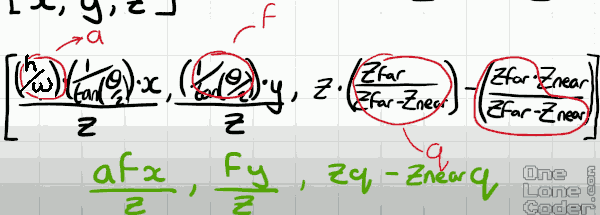
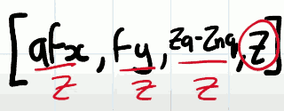

# 3D Engine , Part 1


##  Triangles & Projection

- I'm going to suggest that all of our dots are grouped into triangles
    - any 2D primitive can be represented using nothing but triangles
- Finally when it comes to drawing triangles on a screen there are some very optimized algorithms to do this, because a triangle consists of straight lines.
    - and there are also some neat algorithms to fill in a triangle and shade it on the screen, again using straight horizontal lines.


- There is somethign important about the triangles, the order of the vertices we define the triangle. 
    - I want to always use a clockwise order.
        - 使用 clockwise 是因为 左手坐标系的原因?
        - In OpenGL, when looking at the front face of the polygon, vertices should be listed in counter-clockwise order. This is the default rule used by OpenGL. 
    - 
    - exactly the same for the remaining faces.

## Projection 

let's define our screen.

Because screens come in all shapes and sizes, it's useful to reduce the 3D objects into a normalized screen space. 

- 

And because the width and height can be different we want to scale movements within the screen space accordingly.  So we are going to use the **aspect ratio**.

aspect ratio:  a = h/w.   This will be the first of serveral assumptions about how we're going to transform our 3D vector [x,y,z] into our screen space vector [(h/w)x,y,z].

Normalizeing the screen space has an additional advantage that anything above +1 or below -1 definitely won't be drawn to screen. 

- 

However humans don't see screens in that manner they see instead what's called **the field of view**. Objects that are further away we can see more space.

If the field of view is particulary narrow (see that blue 1) it has the effect that zooming in on the object. And if the field of view goes wide, it has the effect of zooming out, we see more stuff. 

- 

And this means we need a scaling factor that relates to the field of view, **θ**. One way to think about the scaling factor is to draw a right triangle right down the middle of our field of view. 

- 

And as this angle ( θ/2 ) increases,  our opposite side of the triangle increases.  We might want to consider looking at the tangent function tan(θ/2).

But there's a slight problem here if we take a point and we increase our field of view, the scaling factor tan(θ/2) get larger.  But actually when we increase FOV, we should have the effect of zooming out.

So what we want is the exact opposite of this. Indeed we want the inverse

```
1 / tan(θ/2)
```

This gives us some more coefficients to add to our transforamtion `[x,y,z]->[(h/w)Fx,Fy,z]`  , where F = `1 / tan(θ/2)`

Since we've gone to the trouble of normalizing x and y. And realistically all we're interested is in x and y because this is a 2D surface in the end. 

We may as well also attempt to normalize z, and the reason for this might not be immediately apparent. But knowing what z is in the same space as x and y can be really useful for optimizing our algorithms and handling other interesting drawing routines like transparency in depth.

Choosing a scaling coefficient for the z axis is somewhat more simpler. The z axis going forward into the distance.  The furthest distance of objects that we can see will be defined by this plane at the back, which is *z far*.  You might assume that means where the screen is at the front would be 0, but that is not quite the case. But the player's head isn't resting against the screen, there is a small distance.  I'm going to call it *z near*, which is the distance represented from the player's head to the front of the screen.

- 

```
z' = (z-Znear)/(Zfar-Znear)
```
 
But we've decided that our far plane should be 10, so we need to scale it back up again. 

```
z' = (z-Znear)· Zfar/(Zfar-Znear)
   = z· (ZFar / (ZFar - ZNear) ) - ZNear·(ZFar / ( ZFar - ZNear ))
```


So now if we look at our initial coordinates and look at the final transformed coordinate, it is a bit complicated and not even quite finished yet.

- 

Intuitively we know that when things are further away they appear to move less so this implies that a change in the x-coordinate is somehow related to the z-depth, inversely proportional x'=x/z.  And this is analogous for y , y'=y/z.

So our final scaling that we need to do t our x and y coordinates is to divide them  by z. 

- 

Let's start t simplify some of this out.

- 

We could go and implement these equations directly but instead I'm going to represent them in matrix form.

```
[x,y,z,1]
```

```
aF 0  0   0
0  F  0   0
0  0  q  -Zn·q
```

How to represent "divide by z " ? I can't readily do that in this calculation. Getting the divided by z is going to need to be a second operation. In fact we're going to be normalizing the vector with the z value. 

So I do want to extract it.  And to do this , 

```
aF 0  0   0
0  F  0   0
0  0  q  -Zn·q
 0  0  1  0 
```

It will give us  [aFx, Fy, Z·q - Zn·q , z]. And after I've performed the transformation, and then going to take the last element of this vector , and use it t odivide the others, giving us a coordinate in Cartesian space. 

- 

( for consistency, it's better to divide everything by the same number; dividing Z by Z doesn't spoil anything, but allows you to express stuff via matrix algebra.  )

Bring this structure all together , this is called the projection matrix, it is actually probably one of the most complicated transforms...

You can really treat it like a black box this projection matrix will work for all 3D applications. And it's highly customizable in terms of aspect ratio , field of view , and viewing distance. 

**Our projection matrix will give us results between [-1,1]**.

- We need to scale that field ([-1,1]) into the viewing area of the console screen.
    1. shift the coordinates to between [0,1]
    2. scale it to the appropriate size

- 


## Recap: to construct a projection matrix

1. aspect ratio: h/w 
2. field of view:  1/tan(θ/2)
3. normalize z: (z-Znear)· Zfar/(Zfar-Znear)
4. x,y showhow related to z:  x'=x/z

[Building a basic perspective projection matrix](https://www.scratchapixel.com/lessons/3d-basic-rendering/perspective-and-orthographic-projection-matrix/building-basic-perspective-projection-matrix)


[Left- vs. Right-handed coordinate systems](https://www.evl.uic.edu/ralph/508S98/coordinates.html)
