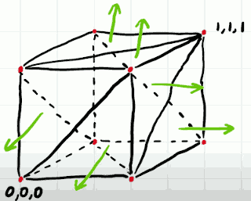
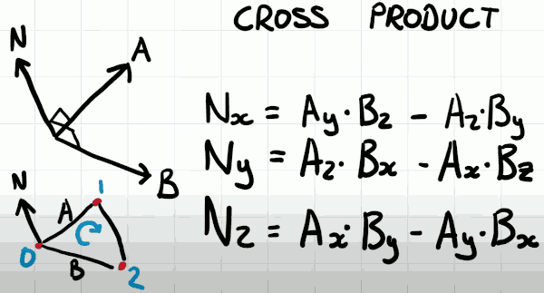
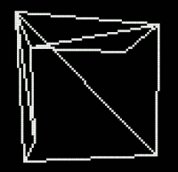
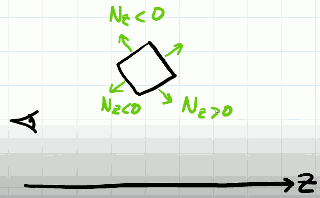
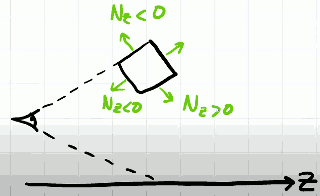
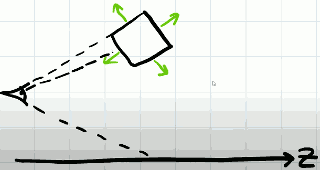
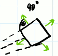
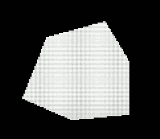
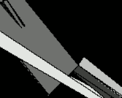
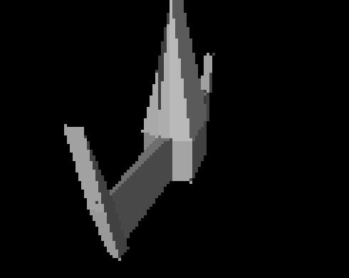

# 3D Engine 2: Normals, Culling, Lighting & Object Files

- 

Let's remove the triangles that we can't see.

3D engines exploit 2 main things.firstly vertex geometry, and the normals to the surface.

A normal is an imaginary line which is perpendicular to the plane that contains the triangles.

- 

Our model doesn't contain any normal data. We're going to generate it as and when we need it. This will differ from 3d engine to 3d engine implementations. As the engines become more sophisticated you will in fact see that is quite common to include normal information as part of the model. Fortunately there are some geometric techniques for getting normals -- cross product.

- 
    - **Note**: since we're using a left-handed coordinates system, the cross product should also use left-handed rule.

Crudely speaking any of the triangles that have a normal whose z component is negative we can see, whereas those that have a normal that have a positive z component we can't. 

So knowing the z component we can crudely optimize our cube to be consisting of only triangles that we can see. And we'll see shortly **this isn't entirely true**, and we can do a better job.

If we calculate the normal before we do projection, we can still see that there are faces that we shouldn't be able to see.

- 

This is because we've not taken projection into account. We've got nothing that says where the eye is in the world space relative to where that normal is. And traditionally this is where we would introduce the concept of a camera.

Cameras do add a lot of complication, I'm going to commit to the entire next part to cameras, for now I wish to represent the camera as a vector localtion in space, and I'm going to keep it fixed at (0,0,0).

If we take a side-on view of the world, we can start to see what's causing this problem. 

- 

so far we're filtering normals based on the z-component.   The problem we've got is the upper face should not really be seen, because perspective with the field of view shouldn't allow for that to happen. 

- 

Because we're not considering where the surface is in 3D space relative to where the camera location is, we're actually assuming that all of our normals exist exactly on a plane directly in front of the camera. 

Instead of just inspecting the Z component alone we need to look at the z-component relative to the line of projection from the camera to the location of that normal in 3D space. 

What we really need to detect is how much of the normal is in line with the imaginary cast from the viewing postion to the location of normal.

- 

In this normal , for example, we can see that the angle will be about 90 degree. and we shouldn't be able to see it.

- 

Only triangles with angle less than 90° should be seen.  we can use **dot product**.

```
vec_normal.Dot(  triangle.P[0] - vec_camera )
```

- PS. we can take any point on triangle because they all lie within the same plane.

- 

We can see the outline of it indeed looks like a cube, but because there's no sufficient shading going on the sides of the cube, our brain simply can't interpret what we're looking at. So we need add a source of illumination.  And I'm going to bother illuminating the triangle if we can see it, because the more calculations that we're adding, the more expensive it's becomeing to draw triangles. 

```
var light_direction_nomalized =  m3d.Vec3D{ X:0,Y:0,Z:-1 }
```

You will see oddly I've specified the z-component to indicate that the light is shining towards the player. Indeed its not quite true. There is a reason for this.  That's in our simple setup we can assume that a triangle is more lit the more its normal is aligned with the light direction, we'll see in the next video that's not quite true, but for this one it's sufficient to give us some clarity when we're trying to determine the shape of the objects. 

---------

Blender can show the normals of model. But I won't be exporting this normal data as part of the object file. It's important that the model consists solely triangles because our simple engine only understands triangles. When exporting object format ,  only check "Triangulate Faces" and uncheck others. 

- if you change export setting from '-Z forward to Z forward', all x,z values will be negated, the face's vertex and order won't be changed.
    - in right-handed coordinate system, all visible faces are in conter-clockwise order.
    - it effectively rotate the model object 180 degree along with Z axis (in blender) , and then export the data

- 

What's going wrong?

- Two things are happening here. 
    1. first,we're not drawing triangles in the correct order.
        - that means we're actually triangles that are further away on top of triangles that are closer to the users. 
        - this makes the model look a bit like a mess
    2. the second problem is that as the triangles approach the camera position, the projection will divide the z value, as z gets smaller and smaller , the x,y value of triangle get much much much bigger. 
        - to solve that problem, we need to cliping.

To solve the first problem :

In a normal 3D Engine, we would have something called a depth buffer and that is where every pixel on the screen also has z value associated with it. So when we want to draw a new pixel, we test that pixel against that value that's already in the depth buffer.  and if it's in front of that pixel , we draw it. If it's behind it we don't draw it. 

In this simple 3D engine, I don't have that luxury. So instead what I'm going to do is take the midpoint value of the triangles take the z-component at that midpoint and sort the triangles based on that value. and we'll draw them from back to front. This is called the painters algorithm.

- 

Our z sorting method on the whole works very well indeed. It is a hack so there will be some slight imperfections. You can just see them on the edges of the wings. 


## Recap 

- filter invisible triangle
    - before projection, taking dot product
- illuminating
    - dot( light, normal )
- drawing order
    - depth buffer
    - alternative: painters algorithm


