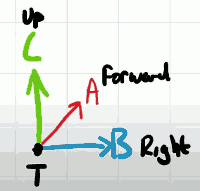
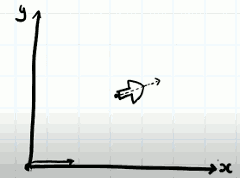
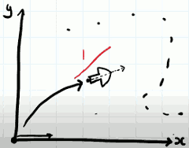

# 3D Engine 3: Cameras & Clipping

- matrix lib:
    - go: github.com/go-gl/mathgl
    - c++: glm

Camera has 2 approaches.  1 is moving the camera , the other is to move the entire world. 

Our camera is always at (0,0,0),  so we could go through every object in the game and translate them to a diffrent location to give you illusion that that they were walking through that would. 

However this can get a little bit tricky when it comes to rotation because the center of rotation of these objects changes. So I think it's a better approach to represent the camera as a object in the world, and create some sort of transform which we can apply. 


## "Point At" matrix 

- 


```
Bx Cx Ax Tx
By Cy Ay Ty
Bz Cz Ax Tz
0  0  0   1
```

- give pos, target, up
    - TODO

We can use our point at matrix to postion and rotation our object in our world space, like any of the other matrix transforms.  So far we've always assumed that the player of the camera is at origin , and looking down one of the axis, in 3D it would be z, but in this 2d example , it's looking along the x-axis. 

- 

Since we now have a transformation, we can ideally use this direction and point as a camera. The point at transformation has worked out how to transform from the origin point to this location, but the camera needs to do the exact opposite.  It needs to take all points anywhere in space and transform them back to our original (0,0) looking along a single axis. 

We want effectively the inverse of whatever this transformation was. 

- 

Fortunately to us, and this only applies to matrics that can rotate and translate. If you're scaling this won't work. there is an established routine for inverting this matrix:


```
Bx By Bz -T*B
Cx Cy Cz -T*C
Ax Ay Az -T*A
0  0  0   1
```

Again, this isn't the correct procedure for all 4x4 matrices, this only works in this instance. 

Our A,B,Cverctors still exists in the inverted form. They've just been transposed. But our translation vector they now become the dot product between our translation point and one of our axis vectors  and subtracted from 0.

I'm goint to call this **LOOK AT** matrix.

So once we have transformed any object's coordinates into world space we can multiply it by this matrix to translate it into view space, i.e. looking through the lens of a camera.

We can position that camera anywhere in world space and we can make it look at almost anything in world space.


## Recap 

- look at matrix
    - translate into view space.
    - do it before projection
