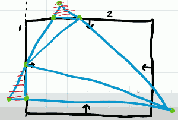

# 3D Engine 3: Cameras & Clipping

- matrix lib:
    - go: github.com/go-gl/mathgl
    - c++: glm

Camera has 2 approaches.  1 is moving the camera , the other is to move the entire world. 

Our camera is always at (0,0,0),  so we could go through every object in the game and translate them to a diffrent location to give you illusion that that they were walking through that would. 

However this can get a little bit tricky when it comes to rotation because the center of rotation of these objects changes. So I think it's a better approach to represent the camera as a object in the world, and create some sort of transform which we can apply. 


## "Point At" matrix 

- 


```
Bx Cx Ax Tx
By Cy Ay Ty
Bz Cz Ax Tz
0  0  0   1
```

- give pos, target, up
    - TODO

We can use our point at matrix to postion and rotation our object in our world space, like any of the other matrix transforms.  So far we've always assumed that the player of the camera is at origin , and looking down one of the axis, in 3D it would be z, but in this 2d example , it's looking along the x-axis. 

- 

Since we now have a transformation, we can ideally use this direction and point as a camera. The point at transformation has worked out how to transform from the origin point to this location, but the camera needs to do the exact opposite.  It needs to take all points anywhere in space and transform them back to our original (0,0) looking along a single axis. 

We want effectively the inverse of whatever this transformation was. 

- 

Fortunately to us, and this only applies to matrics that can rotate and translate. If you're scaling this won't work. there is an established routine for inverting this matrix:


```
Bx By Bz -T*B
Cx Cy Cz -T*C
Ax Ay Az -T*A
0  0  0   1
```

Again, this isn't the correct procedure for all 4x4 matrices, this only works in this instance. 

Our A,B,Cverctors still exists in the inverted form. They've just been transposed. But our translation vector they now become the dot product between our translation point and one of our axis vectors  and subtracted from 0.

I'm goint to call this **LOOK AT** matrix.

So once we have transformed any object's coordinates into world space we can multiply it by this matrix to translate it into view space, i.e. looking through the lens of a camera.

We can position that camera anywhere in world space and we can make it look at almost anything in world space.


## Clipping

- 

This happens when the objects got too close to the camera. When we're projecting the triangles they have a z component which we divide by. And as z component get smaller and smaller our x,y coordinates get larger and larger, our triangles get huge. We're getting memory and performance problems. The second problem is that sometimes the triangles will now exist behind the camera. We need to clip those triangles.

Considering a line in 2D space: y = mx + c.

- 

Here, m is the slope, m = dy/dx , that is

```
y = (dy/dx)x+c
ydx = xdy + c
ydx - xdy = c
```

Instead of having a gradient what we actually have is a normal to the line.

- 

N = (-dx)/dy.  So,  dy/dx = -Nx/Ny

```
yNy + xNx = c
```

for any point P on the line 

```
yNy + xNx = PxNx + PyNy 
yNy + xNx - P·N = 0
```

This means just by knowing a single point on a line and a normal to the line, we can represent a line. 

Extending to 3D is quite simple, we just add the z term. But it is not a line anymore, it's a plane.

```
xNx + yNy + zNz - N·P = 0   // 3D Plane
```

This is in fact the standard plane equation:

```
Ax + By + Cz -D = 0
```

Now let's get back to graphics and start thinking about clipping.

## CLIPPING

I'm going to show this in 2D because it is easier to draw. 

- 

Given the original points of my triangle and now the intersection points between the edges of the triangle and the *line* I'm using to clip against, I formed a quadrangle.

- 

So in this configuration I need to split that into 2 triangles. 

- 

Here is a second configuration, it only form one triangle once I clip it.

- 

This implies there's a bit of an algorithm that we need to do. I'm going to need to count how many points lie on the inside of the line I want to clip against how many points lie on the outside. 

There are 2 additional scenatios.  3). all 3 points lies on outside.  4) all 3 points lies on inside. 

```
// algorithm 
1. count inside points
2. count ourside points
3. classify triangles
    if inside == 3:
        do nothing
    if inside == 0:
        reject
    if inside == 2:
        form quadrangle
    if inside == 1:
        form new triangle
```

We're going to need a clipping function which is capable of returning 0,1, or 2 triangles depending on the scenario.

If it is returning a single triangle I can form that triangle with the original inside point, and the 2 points were the original edges of triangle intersect with the clipping line. It's important to remember to maintain the clockwise order.

- 

If I'm producing 2 additional triangles I can take the 2 original inside points  create the first triangle using the intersect point between 1 edge and the clipping line.

- 

The 2nd triangle needs to be thought about to ensure it winding order is correct.  We can take the original point and the 2 new intersection points that ensures we've got clockwise winding order. 

- 

This isn't quite the end of the story. We want to clip triangles against the edges of the screen , which we can easily define using normals and points. 

- 

Let's assume I have a situation like this  where I have one big original triangle that needs clipping against multiple edges.

- 

This is a common scenario. We need to think of an algorithm for handling clipping against multiple edges. The previous algorithm forms either 0,1,or 2 triangles  each time we clip. So let's start with the left side edge, we're only clipping against this one edge, ignore the others for now. Once this triangle is clipped, the solution is actually forming a quad, 2 triangles. 

- 

Now let's take our top edge. One of the triangles we can see entirely that it's 3 points lie inside the clipping edge. We don't need to anything with that. But we don't want to ignore it so that needs to pass through our clipping function.

However yet again we're going to form a quad with the other triangle 

- 

Now the right edge.  Things start to look a little bit more complicated. We've now got 3 triangles in existence.  One has all points lies side so that one can pass through. However the other 2 have to break up into quad respectively. 

- 

The final bottom edge we must also check. But we can see now all of the triangles that remain lie on the positive side. So no clipping need to occur here. 

Our original triangles has now been split into 5 triangles. All of the triangles share the same properties as the original triangle so the color information doesn't change. 

The complexity of this part of the algorithm is not necessarily in the clipping. It's in the fact that the byproducts of clipping can result in a multiple number of new triangles. so we'll create a clipping function that returns the requisite number of triangles in order to satisfy the clip , and we'll add those triangels into a queue to be processed further. 

Fortunately we know that once we've clipped against one edge there will be no further triangles created that need testing against that edge. All remaining triangles as a consequence of the clip need to be tested against the remaining edges. 

```
// algorithm pseudo code
Q <- Triangles
For each plane
    for each triangle in Q
        T <- Q.front
        New Q <- CLIP( T, Plane  )
    Q = New Q
```

- create a queue to add the triangle that needs clipping
- and then for each clipping plane
    - pop the first triange in queue
    - test that popped triangle using the clipping function
    - once I've gone through all of the triangles in the queue , I have new list of new triangels 
        - repalce Q with this list of new triangles 


## Recap 

- look at matrix
    - translate into view space.
    - do it before projection


