# Light Shadow

## Polygon Map

The shadow casting algorithm itself relies heavily on geometry and if we have to do geometry for all of the blocks every single frame, that's not efficient. 

So the first stage of the algorithm is to convert our tile map of blocks into a polygon map of edges.

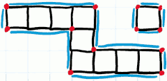

Once you move out of the blocky world of the tile map into the smooth world of the polygon there are lots of other advantages we get as well.  We could implement realistic physics and collision detection. We can have edges which don't align with the natual tile boundaries in the world. And of course we can have natural-looking gradients and slopes. 

I want to construct these polygon boundaries in the most efficient way possible. So ideally given a cutout of the large world I want to scan through it once to create the set of edges.

I start from the top left and I'm going to scan horizontally across the screen and when I get to end I start the next row. 

- Cell: each cell has properties:
    1. exist bool
    2. edge_exist[4]   ( N,S,E,W )
    3. edge_id[4]   (N,S,E,W)
        - id of a given edge on the north,south,east or west side from some edge pool that will create else where. 

- 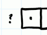
    - Do I have a western neighbor ?
    - Clearly I don't have a western neighbor, so I definitely have a western edge.
    - But where do I get this edge from ? The only other place an edge could come from  is from a northern neighbor that also has a western edge, and in effect we'll take that edge and grow it downwards.
    - 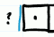
    - 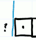
    - In this situation we don't have a northern neighbor.  So we're going to create a new edge.
    - So we'll add it, call edge A, to our edge pool. and our cell structure will link our edge_id to the location of the edge in the edge pool, 0.
    - 

- We'll now systematically check the other sides of the tile.
- firstly we'll check the eastern edge. 
    - if I have an eastern neighbor ?  Yes. then cleary it has not an edge.
- Now we need to check our northern neighbor.
    - I don't have a northern neighbor in this case. 
    - So I need an edge. Where can I get one from?  Well I can either get 1 from my western neighbor , or I need to create one of my own.
    - 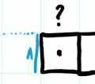
    - Since I don't have a western neighbor I'm going to have to create new edge B with id 1.
    - 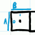
- It's a similar for this southern edge too. We need to create a new edge C.
- Now we move to next cell.
    - 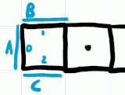
    - Do I need a easter / western edge ? No,
    - Do I have a northern neighbor? No, I need a edge. This time rather than creating a new one, my wetern neighbor currently already has a norther edge. So I going to extend that edge to suit my need.
    - 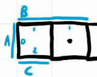
    - So do the southern edge.
    - 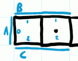
- Exactly the sam routine occurs for the 3rd cell.
- Let's run through it again for the corner cell.
    - 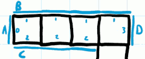
- Next cell is the standalone cell. 
    - 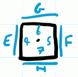

--- 

- 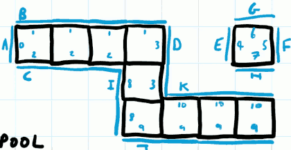
- Edge Pool:
    - 0:A, 1:B, 2:C, 3:D, 4:E, 5:F, 6:G, 7:H
    - 8:I, 9:J, 10:K, 11:L
- Once we've gone through all of the tiles we're interested in we'll have an edge pool that contains only the bounding edges of the shapes. 
    - And the edges are defined by a start and an end coordinate. 
    - It's very possible that edges will share a coordinate.
    - We've converted our tile map into a set of edges. **Not strictly a polygon**,  because we've not defined what's the inside and the outside of the polygon.
    - But we can assume that things don't pass through edges in our applicaiton.

## Shadow Casting

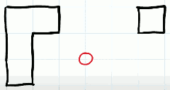

We're going to project rays from this source radially out into the scene. 

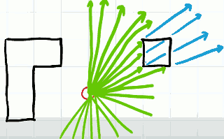

We're only interested in rays that intersect with our line segments, even more so we're only interested in rays that seemed to intersect with the cornice. 

For each edge in pool, I'm going to project a ray to its start and end point.

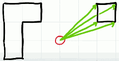

When the ray intersects with the line(edge) we know the ray effectively starts turning into shadown.  Let's consider not looking at areas which are in shadow but instead which areas are in light. 

The 2nd ray down  had to intersect with another on its way there. and we'll record the intersection point that is closest to the source of the ray. And we'll do that for all 4 rays cast out.

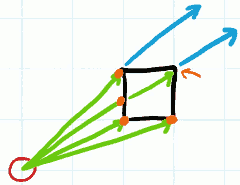

Let's do the same for all rays for the other objects too.

If I add one more point, the source, what I actually constructed is a fan of triangles. And these triangles construct a polygon which covers the area that is definitely visible from the source.

The problem it's a bit of a strange polygon because if I shaded in this polygon with light, we can see there's some big gaps  which are defintely visible but they've been ignored by the algorithm.

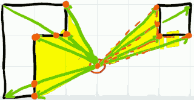

What can do about these big gaps ?  There's a little hack that we can apply. 

Instead of casting one ray from the source to a vertex, we cast 3 rays. One goes directly to it, and one either side displaced by a tiny fraction angle. so one will  miss the vertex, and the other will hit a line.

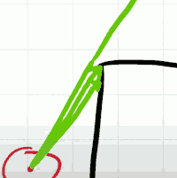

## Visible Polygon

[2D Visibility](https://www.redblobgames.com/articles/visibility/)

For the vertex of the visible polygon, we need store extra 'angle', so that we can draw sensible triangles in the fan.

Since we're going to iterate through our vector of edges to cast rays, this could theoretically happen in any sort of order. Which means when I come to draw these triangles later on I can't do it sensibly I effectively need to draw there points in some rotational order. 

The easiest way to do that is not just to store the point on its own but take an arbitrary axix from our source point, and record the θ values of each of the points. so for each point, I'll have a ( θ,x,y ).

I can then sort these points based on θ to make sure that they're in this clockwise order. 

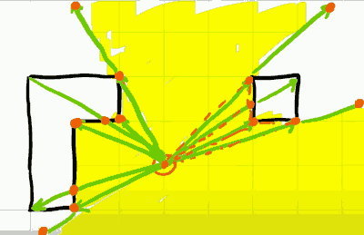

## Line Segment intersection

[detect line segments intersection](https://stackoverflow.com/questions/563198/how-do-you-detect-where-two-line-segments-intersect)

For every single ray, we now need to check for intersection between the ray and all of the edges in the polygon map.

The algorithm now come down to a simple line segment intersection test.

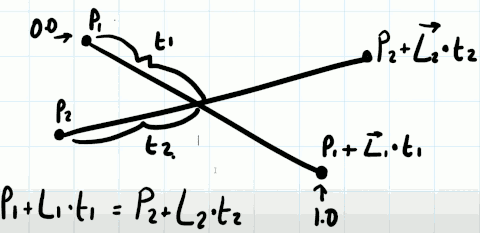

