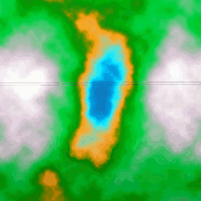
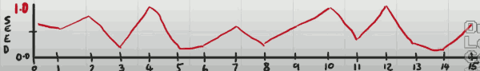
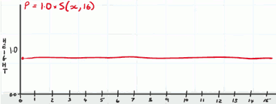
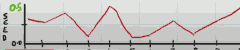
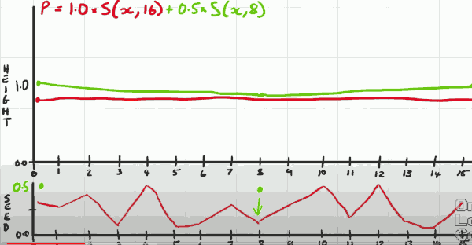
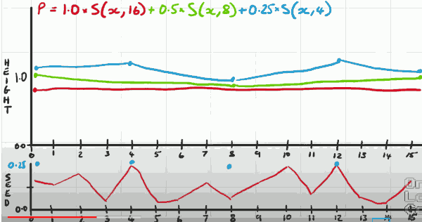
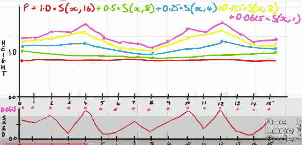

# Perlin-like Noise

To create a more natural looking noise a scientist , Ken Perlin, came up with an algorithm which generates noise that has local coherance. So even though it is still random it has features that are clustered together.

You can use Perlin noise to create artificial terrains. 

Perlin noise can be generated in multiple dimensions. In this case we've got a 2D Perlin noise map but this is actually 3D because we're looking at it from top. The intensity of the pixel can be considered height. 



If we were to take a slice through a particular line of this image we'd end up with a 1D array of Perlin noise which would be like looking at the mountains from the side.

## Generate 1D perlin noise



I have a 1D array of noise **seed**. I have 16 elements in the array and these are just generated by the random function.

We generate Perlin noise by selecting values from the seed array at specified pitches which we can also call octaves. 

Starting at the beginning I'm going to say that our Perlin noise is going to be our scaling factor , which is 1.0 in this case, times our sample of x, but the pitch size is going to be the size of the array to begin, which is 16, which rather curiously means we're going to sample at the zero location.  ( seed index i % 16 == 0 )

```
p = 1.0 * S(x,16)
```

In this case it looks to be about 0.7.   And we linearly interpolate between the 2 values, but this leaves is only one choice because both value are 0.7 ( 0th and 16th ), out linear interpolation is going to be a straight line.



This may seem a bit odd but wrapping around like this enables some quite desirable properties of Perlin noise which we can exploit later on.

We've now generated 1 octave of Perlin noise so we'll move on to the next and we're going to halve the scaling factor, and halve the pitch.

```
p = 1.0 * S(x,16) + 0.5*S(x,8) 
```

So we don't change the contents of our seed array we just change maximum value we've scaled it. 



We're now sampling 0th and 8th ( seed_index i % 8 == 0 )

Now this time in our noise array the 0th noise is about 0.3, previously it was 0.7. So we add 2 together.  We also need to include the 8th element, it about 0.1. 




We've now completed the 2nd octave. So it's the time to move on the 3rd one.


```
p = 1.0 * S(x,16) + 0.5*S(x,8) + 0.25*S(x,4)
```

So this time we need sample 4 points , 0th, 4th, 8th, 12th. And add them to the green line, eventually we draw a blue line.



So on so forth.



The final magenta line now reflects our Perlin noise output. But it's quite useful to make sure that the result of our Perlin noise function lies between 0 and 1.  So we need rescale them.  The simple way to do it is divide the output by the sum of all of the scaling factors (1+0.5+0.25+0.125+ 0,0625).


Because the 0th and 16th output will be the same height. That means we can tessellate Perlin noise. It will move smoothly from one side of image to the next.

And because we've constructed the noise using octaves all of the features in this output graph have a comparable size. We've gone from an originally very noisy source in the seed , to a noise pattern which has some local coherence. And it is the local coherence which leads to an organic noise.  And when we've got an organic noise we've got a noise which is more suitable for generating natural looking things because we preceive the coherent in the output. 

Through this Perlin noise is a great noise generate for lots of things in games. Such as landscapes, terrains, mountain, procedurally generated textures, maps, rooms, all sort of things. 


