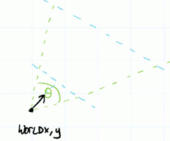

# Pseudo 3D Plane

This was a technique made popular by the super nintendo.  I'm going to use a super mario kart as an example where an image is is taken as the ground plane and it is roated and scaled and translated around the cameras necessary to give the impression of a 3D environment. This was known as mode 7 which for the super Nintendo was just really implementing an affine transform in hardware. 

I'm not going to use affine transforms directly because I want to play with some of the parameters and see what happens.

I'm going to create a big sprite and we know that behave just like textures. We can sample texture from 0.0 to 1.0.  This makes sampling the texture scale invariant. 

I'm going to treat this big picture as if it were my world map , or the mario kart track in this case.  In this map, I'm going to have a postion which represent where are the camera is and I'm going to call this position "world X,Y".  The camera also have an angle associated with it, the angle is what direction is the camera looking at in this plane. 

From this information, I'm going to create a viewing frustum but I need a little bit more information first. 

Firstly I need a field of view, call that θ.  And then we need 2 more pieces of information I need to know what is the nearest location to the camera and which is the farthest location from the camera. There are going to be the lines that straddle our viewing frustum.

If we were to continue drawing our camera vector what we can see about these 2 lines is they are at right angles to the camera is looking. 

This gives me 4 coordinates. I'm going to use those coordinates to give me a region which I will sample to display to the use. And this is my frustum.

Once we've got the frustum we can now determine the mapping between what the player can see on the 2d plane versus what they can see on the screen. 

In the console window, y axis grows top to bottom, and x axis goes rightward.  So the farthest away Y location is going to be towards the to of the window. 

We'll notice that the x-axis changes length depending on where it is in *y* axis.  When we're far away we're looking at a lot more X than when we're close to it.  This means we can take any X,Y coordinates in the console screen window work out where it lies inside our frustum and that becomes the sampled point that we will display on the screen.

I'm going to put some naming convertions. 

