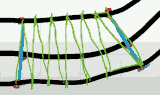

# Racing Line

1. creating a spline
2. at each spline control point, step out a particular distance on the direction perpendicular to the slope. 
    - call this distance track width
3. using those new positions to create 2 new splines

This approach allows to use a single control spline along the middle,

PS. The track width along the path are not uniform !

How to fill the track ? Well we can just fill the triangle between adjacent points of the outer track boundray splines. For example 

The downside is that triangles have straight edges, the track is going to look a bit clunky.

Instead, I'm going to subdivide the spline into little steps. This allows to approximate the track with a lot more accuracy.

Now we've handled the drawing of the track. Let's talk about how we're going to handle the racing line. And I want to take the approach where I can store the racing line using the same number of nodes that I'm using to store the track. 

Along the normal of each control point, I'm going to store an additional variable, call it **displacement**.  What this means is somewhere along this normal I'm going to have a unique value which describes how far along here do I need to go from the middle. 

So my dispalcement value gives me an indication of whereabouts on this vector do I place the node. 

So our racing line should be bounded by the control path , because the displacement component can't go beyond the track width.  

And I want to evolve my racing line towards a solution.  

So for each frame update, I'm going to assume that my racing line is at the same position as my control spline, but then I'm going to slightly alter the displacement values per iteration of evolution in an attempt to get this system to converge to a stable solution.

