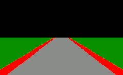
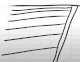
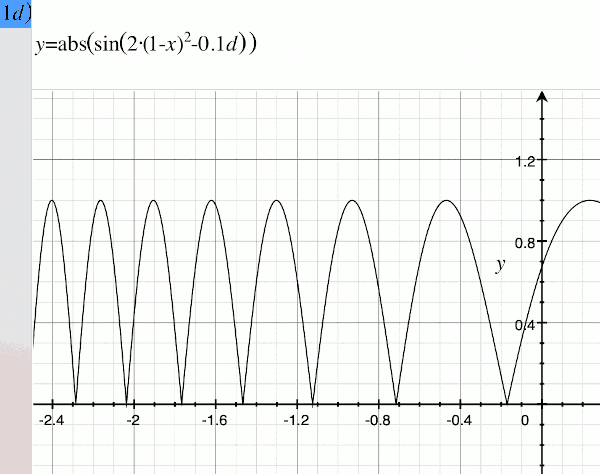
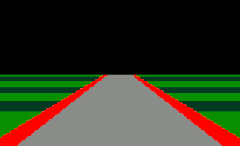
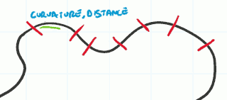

# Retro Racing Game

- How to represent track 
    - trackWidth := y / (screenH/2), for `0 <= y <= screenH/2`
    - 

- How to represent car is moving ?
    - use different grass color
    - but the color should not be distributed uniformly. It should be looked like prespectively.
    - 
    - We can achieve thie line positioning by using some sine function.
    - 
    - the x-direction represents the perspective.
    - d is the phase, the phase represents the distance the car is moved around the track.
    - in game, we may modify the function to `sin(20*(1-x)³ + 0.1*d)`
    - 

- How to define a track ?
    - break the track into discrete sections , and label each section with curvature and distance. 
    - 
    - as the player moves around the track, we look how far they've traveled. Accumulate the distance for all of the sections and work out which section they are in.  and all we need to display on the screen is the tracks curvature. 

