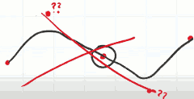
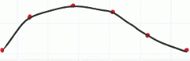
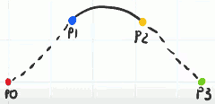
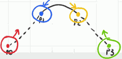
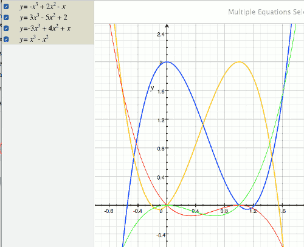

# Splines

[wiki splines](https://en.wikipedia.org/wiki/Spline_(mathematics)  The wiki is too mathematical...

- Deciding where to put the control points is not ideal. We'll not use that type of spline.
    - 
- Instead we'll use such spline that you can multiple control points and the path is guaranteed go through all of them.
    - 
    - It is called Catmull-Rom spline

## Catmull-Rom Spline

- In this most basic form, Catmull-Rom spline contains 4 control points. 
- It only generates a curve between p1 and p2. And it uses p0 and p3 as a gide to what angle the curve should be going through the p1 and p2. 
- 

- To find a point, t,  along the spline, which begins at 0 for p1, and ends at 1 for p2. So we're accessing the curve segment in normalized space. 
    - 
- The nice thing about Catmull-Rom spline is the points can be multi-dimensional , and the mathematics doesn't change just scales up.  
- It is useful to think about the points as being the center of influential circles that guide our point t.
    - so simply put t approach p1, we're more influenced by p1, and less influenced by p2.
    - the point lies directly in the middle of p1 and p2 were equally influenced.
    - and if the point is on one control point p2,  then it were 100% influenced by p2 , and nothing comes from p1.
- p0 and p3 also are influencing our point on the curve, but in a much more mild way.
    - so whereas we saw p1 and p2 attract our target points, p0 and p3 repel the target. 
    - 

## The Math Behind The Spline

- Consider the x-axis to represent our variable t in normalized space, so it goes from 0 to 1.
- Consider the y-axis to be the amount of influence the point has on our point t going around the curve segment. 
- blue curve: p1 , orange curve: p2,  red: p0,  green: p3
    - p0: -x³ + 2x² - x
    - p1: 3x³ - 5x² + 2
    - p2: -3x³ + 4x² + x
    - p3: x³ - x²
- 
- All of these functions are cubics so this is a cubic spline.
- In 2D space, we'd have to caculate all of these four x and four y , to give us the (x,y) point on the curve segment.

