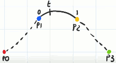

# Splines

[wiki splines](https://en.wikipedia.org/wiki/Spline_(mathematics)  The wiki is too mathematical...

- Deciding where to put the control points is not ideal. We'll not use that type of spline.
    - 
- Instead we'll use such spline that you can multiple control points and the path is guaranteed go through all of them.
    - 
    - It is called Catmull-Rom spline

## Catmull-Rom Spline

- In this most basic form, Catmull-Rom spline contains 4 control points. 
- It only generates a curve between p1 and p2. And it uses p0 and p3 as a gide to what angle the curve should be going through the p1 and p2. 
- 

- To find a point, t,  along the spline, which begins at 0 for p1, and ends at 1 for p2. So we're accessing the curve segment in normalized space. 
    - 
- The nice thing about Catmull-Rom spline is the points can be multi-dimensional , and the mathematics doesn't change just scales up.  
- It is useful to think about the points as being the center of influential circles that guide our point t.
    - so simply put t approach p1, we're more influenced by p1, and less influenced by p2.
    - the point lies directly in the middle of p1 and p2 were equally influenced.
    - and if the point is on one control point p2,  then it were 100% influenced by p2 , and nothing comes from p1.
- p0 and p3 also are influencing our point on the curve, but in a much more mild way.
    - so whereas we saw p1 and p2 attract our target points, p0 and p3 repel the target. 
    - 


## The Math Behind The Spline

- Consider the x-axis to represent our variable t in normalized space, so it goes from 0 to 1.
- Consider the y-axis to be the amount of influence the point has on our point t going around the curve segment. 
- blue curve: p1 , orange curve: p2,  red: p0,  green: p3
    - p0: -x³ + 2x² - x
    - p1: 3x³ - 5x² + 2
    - p2: -3x³ + 4x² + x
    - p3: x³ - x²
- 
- All of these functions are cubics so this is a cubic spline.
- In 2D space, we'd have to caculate all of these four x and four y , to give us the (x,y) point on the curve segment.

- for example, if t == 0.3 
    - p1 = floor(t) + 1
    - p2 = p1 + 1
    - p3 = p2 + 2
    - p0 = p1 - 1
- 

```go
func (self *Spline) getSplinePoint( t float32 ) Point2D {
    // index of points
    p1 := int(t) + 1
    p2 := p1 + 1
    p3 := p2 + 1
    p0 := p1 - 1
    pt_indices := []int {
        p0,p1,p2,p3,
    }

    // when the number of control points > 4
    // t will be > 1
    t = t - float32(int(t))

    tt := t*t
    ttt := tt*t

    q0 := -ttt + 2*tt - t
    q1 := 3*ttt - 5*tt + 2
    q2 := -3*ttt + 4*tt + t
    q3 := ttt - tt
    pt_values := []float32 {
        q0,q1,q2,q3,
    }

    var tx, ty float32
    for i:=0; i<len(pt_indices); i++ {
        tx += self.points[ pt_indices[i] ].x * pt_values[i]
        ty += self.points[ pt_indices[i] ].y * pt_values[i]
    }
    tx *= 0.5
    ty *= 0.5
    return Point2D{tx,ty}
}
```

- so if there is only 
    - 4 control points, then 0 ≤ t ≤ 1
    - 5 control points, then 0 ≤ t ≤ 2
    - n control points, then 0 ≤ t ≤ n-3
- the draw method:
```go
    var t float32
    for t=0.0; t<float32(len(self.points)-3); t+= 0.01 {
        pt := self.getSplinePoint(t)
        pt.Draw( dst, color.White, 1 )
    }
```

- If we have 10 control points,  I take the two end points which in this case 1 and 8 ( not the 0,9 ) ,  and overlap them.  That would actually make a loop but it's a loop with a bit of kink around the point 8. 
    - 
- But I can get rid of that by using the two original end points (0,9) , and overlapping those with the two neighboring points, which gives us a nice prefectly curved loop.
    - 
    - 

- So if we wanted our splines to be loops we could just manipulate the indices.


```go
// modify getSplinePoint function
func (self *Spline) getSplinePoint( t float32, bLoop bool ) Point2D {
    // index of points
    var p0,p1,p2,p3 int
    if !bLoop {
        p1 = int(t) + 1
        p2 = p1 + 1
        p3 = p2 + 1
        p0 = p1 - 1
    } else {
        p1 = int(t)
        p2 = (p1 + 1) % len( self.points )
        p3 = (p2 + 1) % len( self.points )
        if p1 >= 1 {
            p0 = p1 -1
        } else {
            p0 = len( self.points )-1
        }
    }
    pt_indices := []int {
        p0,p1,p2,p3,
    }

    // when the number of control points > 4
    ...
```

```go
// modify draw function
    var t float32
    // contain all poins
    for t=0.0; t<float32(len(self.points)); t+= 0.01 {
        pt := self.getSplinePoint(t, true)
        pt.Draw( dst, color.White, 1 )
    }
```

- 

- It's often be useful to know the slope at any point. 
    - just modify the getSplinePoint function, take derivative on the influence function.


